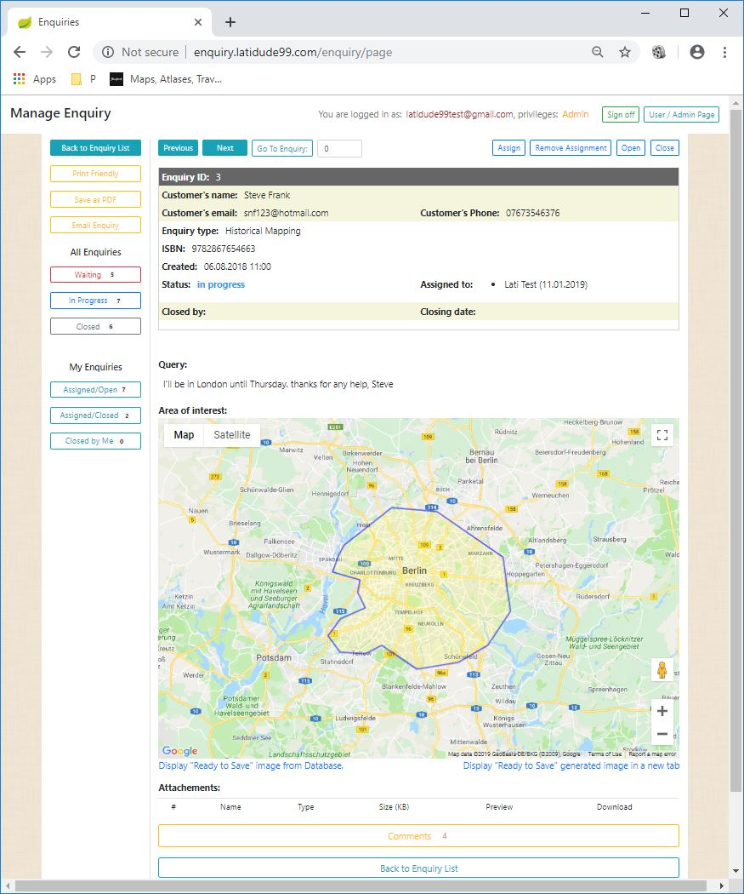

# Enquiry Management System

Customer service enquiry system for a travel bookshop.

## Table of contents
* [General Info](#general-info)
* [Technologies](#technologies)
* [Setup](#setup)
* [Launch](#launch)
* [Features](#features)
* [Status](#status)
* [Screenshots](#screenshots)
* [License](#license)
* [Contact](#contact)

# General Info

A small customer service enquiry system, geared towards map and travel bookshops. Includes options to attach files and draw a polygon on Google Maps making it much simpler to describe the exact area of interest.  

  

# Technologies
- Java JDK 1.8
- Maven 3.60
- Spring Boot 2.0 with Spring Security 5, Spring Validation and Spring Data
- Thymeleaf 3 with Thymeleaf Extras for Spring Security and Java 8 Time API support
- Bootstrap 4
- Google Maps iFrame
- Hibernate
- MySQL
- Apache Tomcat 9.0
- VPS with Debian 8
- JUnit5 5.4.1
- AssertJ 3.12.2
- Eclipse / STS 3.9 , unit tests in IntelliJ IDEA. 

**Plugins and libraries**
- Spring Boot Maven Plugin
- Maven Surefire plugin  version 2.22.0

# Setup

Clone the repository to a folder on your computer and import it in your favourite IDE as a Maven project. 
It uses Tomcat 9.0 as a web server.

### Build

Run maven command: 'mvn clean package'. This should create an executable 'jar' with all libraries needed included.

# Launch

Double click on the executable 'jar' file. The application should be availavle at localhost://8080 in your Internet browser.

# Features

The application consist of two parts:
 - customer side enquiry form
 - enquiry management side for customer service staff
 
 ### Customer Enquiry Form
 - standard fields for customer first and last names, email address and a phone number
 - two-step validation for mandatory fields 
    - Javascript check for empty fields
    - Spring Validation check for the email address  corectness
 - drop-down list with options of the enquiry subject (Maps, Travel Literature, Guides, Customised Maps etc.)
 - message box for the actual enquiry text
 - Google Maps window with an option to draw/delete a polygon delineating the area of interest
 - option to attach up to three files (the limit is set as 1MB for each file at the moment)
 - information of the enuiry sending success or failure
 - login/password fields (with a 'Remember Me option) for enquiry management side
 
 ### Enquiry Management Side
 - main screen is composed of:
    - information about number of enquiries waiting, being processed and total number of enquiries
    - a list of enquiries in a table

# Status
- Development: Closed
- Bug fixing: Open

# Screenshots

  

# License
Enquiry System is free software: you can redistribute it and/or modify it under the terms of the GNU General Public License 
as published by the Free Software Foundation, either version 3 of the License, or (at your option) any later version.
Enquiry System is distributed in the hope that it will be useful, but WITHOUT ANY WARRANTY; without even the implied 
warranty of  MERCHANTABILITY or FITNESS FOR A PARTICULAR PURPOSE.  See the GNU General Public License for more details.
You should have received a copy of the GNU General Public License along with Enquiry System. 
If not, see http://www.gnu.org/licenses/ or write to: latidude99@gmail.com

# Contact
You can email me at latidude99@gmail.com

